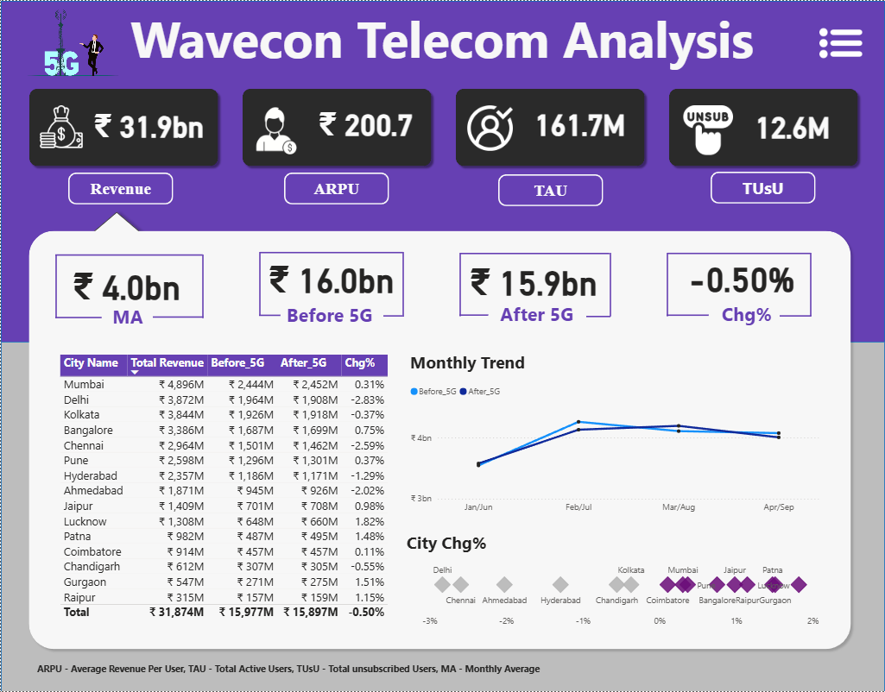
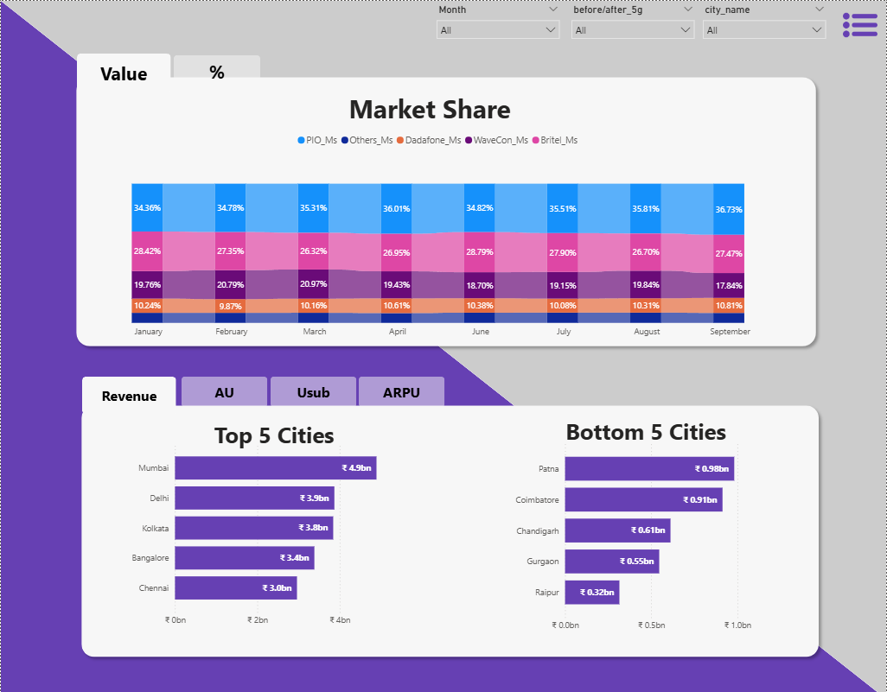
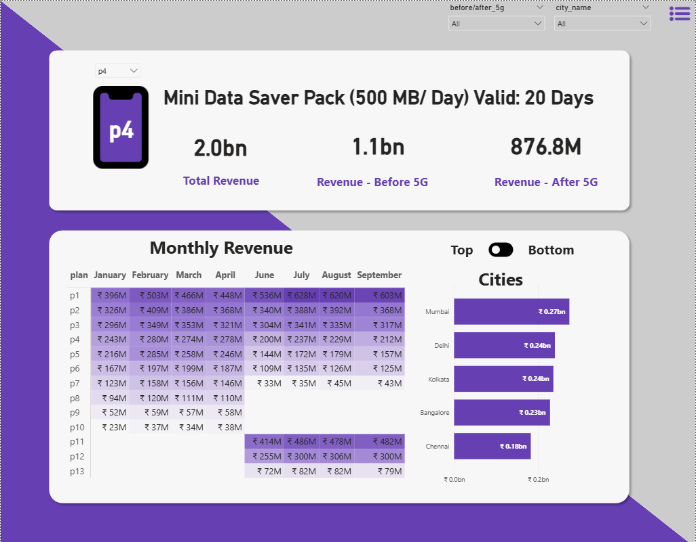

# Wavecon Telecom – Business Analytics Project

## 📌 Project Overview
This project focuses on analyzing **Wavecon Telecom’s business performance** with a special emphasis on the **5G launch impact, revenue trends, KPIs, and city-level breakdowns**.  
The goal was to deliver a **manager-ready presentation** backed by data-driven insights, enabling stakeholders to make informed strategic decisions.

---

## 🎯 Purpose
The purpose of this project was to:
- Assess the impact of the **5G rollout** on revenue and customer adoption.  
- Identify high-performing cities and customer segments.  
- Evaluate plan performance and churn rates.  
- Provide actionable recommendations for leadership in a clear, visual storytelling format.

---

## 🧰 Tech Stack
- Business Analytics  
- Dashboard Design  
- Data Visualization (PowerPoint, Charts, Power BI)  
- Storytelling & KPI Mapping    

---

## 🛠 Approach
- **Data Exploration**: Cleaned and structured telecom datasets (plans, customers, revenue, city-level KPIs).  
- **Analytics**: Applied business intelligence techniques to measure revenue growth, churn, and adoption rates.  
- **Visualization**: Designed crisp, intuitive slides with charts and dashboards for executive readability.  
- **Storytelling**: Connected technical findings to business KPIs and strategic actions.  

---

## 📸 Dashboard Screenshots

Here are some visuals from the Wavecon Telecom analytics dashboards:

### Revenue & 5G Adoption Dashboard

### City-Level KPI Dashboard

### Plan Performance Dashboard

---

## 🔗 Live Dashboard
You can explore the interactive Power BI dashboard here:  
[Wavecon Telecom Power BI Dashboard](https://app.powerbi.com/view?r=eyJrIjoiYzQxZmQ1N2MtNmY3Ny00ZWU5LTkyMTYtYzQ0MDUyMWUyYzQ0IiwidCI6ImM2ZTU0OWIzLTVmNDUtNDAzMi1hYWU5LWQ0MjQ0ZGM1YjJjNCJ9)

---

## 📊 Key Findings
- **5G Impact**: Significant revenue uplift post-launch, with faster adoption in metro cities.  
- **City-Level Insights**: Certain Tier-2 cities showed unexpected growth, highlighting untapped potential.  
- **Plan Performance**: Premium plans drove higher ARPU, while basic plans had higher churn.  
- **Customer Behavior**: Younger demographics adopted 5G faster, while enterprise customers contributed steady revenue.  

---

## 🧠 Learnings
- Strengthened skills in **business analytics and KPI mapping**.  
- Improved ability to design **stakeholder-ready presentations** with actionable insights.  
- Learned how to balance **technical depth with executive storytelling**.  
- Enhanced visual branding and layout consistency for impactful communication.  

---

## 🚀 Conclusion
This project demonstrates how **data-driven storytelling can transform telecom analytics into strategic decisions**.  
By combining city-level KPIs, plan performance, and customer insights, Wavecon Telecom can optimize its 5G strategy and revenue growth.  

---

## 👨‍💻 Author
Developed by **Prashant**  
Passionate about data analytics, visualization, and business intelligence.  
